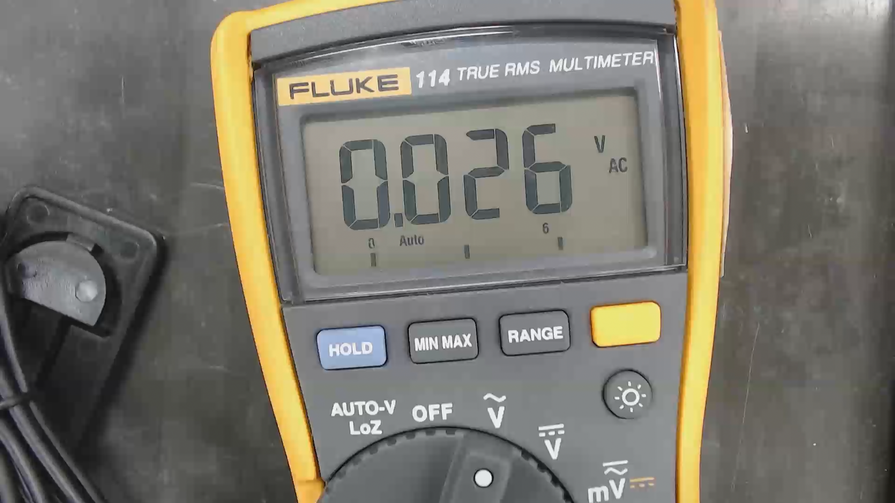

# ssdr
ssdr is a Python script with OpenCV for identifying and interpret seven-segment displays. 

### Input:

 

### Output:


## Installation

Clone this project with:

```bash
$ git clone https://github.com/lukasab/ssdr.git
```

Install requirements using [pipenv](https://github.com/pypa/pipenv) or use:
```bash
$ pip install -r requirements.txt
```

## Usage
To run the example shown here with all images that the script generates you can run:

```bash
$ python main.py -i Last_capture/Last_capture.png -d True
```

Press any key to continue the script.

If you want to use it with your image just change `Last_capture/Last_capture.png` for your image path.

You can also specify the screen coordinates (top_left, top_right, bottom_right, bottom_left) with:

```bash
$ python main.py -i Last_capture/Last_capture.png -sp True
X Top Left: 653
Y Top Left: 266
X Top Right: 1357
Y Top Right: 208
X Bottom Right: 1374
Y Bottom Right: 527
X Bottom Left: 686
Y Bottom Left: 583
```

This helps the program by not needing to search the screen. If you don't know the coordinates, you should use the `get_image_coords.py` script. Just run it with:

```bash
$ python get_image_coords.py -i Last_capture/Last_capture.png
```

Click on the points you want to know the coordinates, it will appear on the terminal. Press 'c' to close the program.

## Contributing
Pull requests are welcome. For major changes, please open an issue first to discuss what you would like to change.

## License
The content of this project is licensed under the [MIT license](LICENSE).